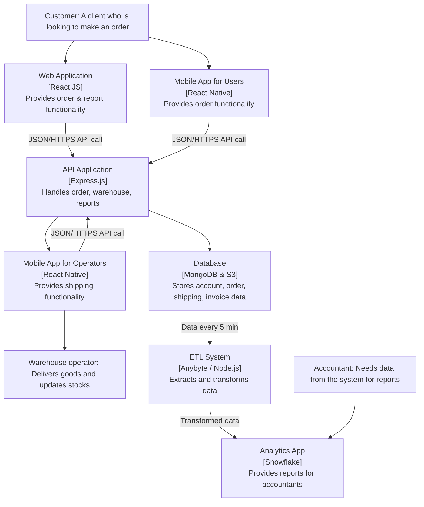
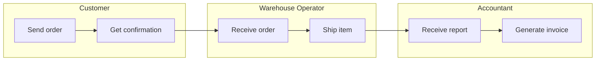
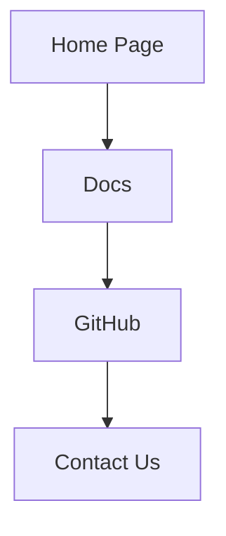

# Configuring

Customize your setup here.

```mermaid
graph TD

  %% Actors
  Customer["Customer: A client who is looking to make an order"]
  Warehouse["Warehouse operator: Delivers goods and updates stocks"]
  Accountant["Accountant: Needs data from the system for reports"]

  %% Components
  WebApp["Web Application\n[React JS]\nProvides order & report functionality"]
  MobileUserApp["Mobile App for Users\n[React Native]\nProvides order functionality"]
  MobileOpsApp["Mobile App for Operators\n[React Native]\nProvides shipping functionality"]
  APIApp["API Application\n[Express.js]\nHandles order, warehouse, reports"]
  ETL["ETL System\n[Anybyte / Node.js]\nExtracts and transforms data"]
  DB["Database\n[MongoDB & S3]\nStores account, order, shipping, invoice data"]
  Analytics["Analytics App\n[Snowflake]\nProvides reports for accountants"]

  %% Flows
  Customer --> WebApp
  Customer --> MobileUserApp

  WebApp -->|JSON/HTTPS API call| APIApp
  MobileUserApp -->|JSON/HTTPS API call| APIApp
  MobileOpsApp -->|JSON/HTTPS API call| APIApp

  APIApp --> DB
  APIApp --> MobileOpsApp
  MobileOpsApp --> Warehouse

  DB -->|Data every 5 min| ETL
  ETL -->|Transformed data| Analytics
  Accountant --> Analytics


```

```mermaid
flowchart LR
  %% Define swimlanes as subgraphs
  subgraph CustomerLane [Customer]
    A1[Send order] --> A2[Get confirmation]
  end

  subgraph OperatorLane [Warehouse Operator]
    B1[Receive order] --> B2[Ship item]
  end

  subgraph AccountantLane [Accountant]
    C1[Receive report] --> C2[Generate invoice]
  end

  %% Cross-lane connections
  A2 --> B1
  B2 --> C1
```

```mermaid
graph TD
  A[Home Page] --> B[Docs]
  B --> C[GitHub]
  C --> D[Contact Us]

  click A "https://example.com"
  click B "https://example.com/docs"
  click C "https://github.com/example"
```