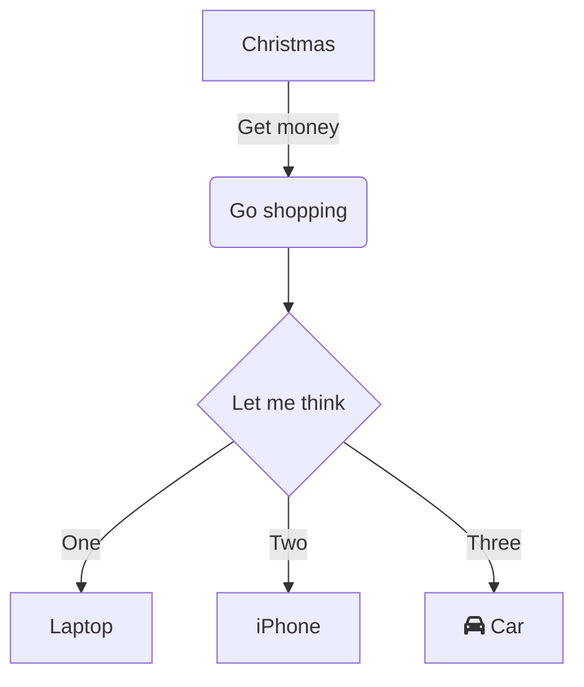

# Installing

Here's how to install the project.

[Link button](https://just-the-docs.com){: .btn .btn-purple }

| head1        | head two          | three |
|:-------------|:------------------|:------|
| ok           | good swedish fish | nice  |
| out of stock | good and plenty   | nice  |
| ok           | good `oreos`      | hmm   |
| ok           | good `zoute` drop | yumm  |

{: .note }
A note

{: .warning }
A warning paragraph...

{: .new }
A new paragraph...

{: .important }
An important paragraph...

{: .danger }
A dangerous paragraph...

Default label
{: .label }

Stable
{: .label .label-green }


```mermaid

flowchart TD;
    id1{{This is the text in the box}}

```

